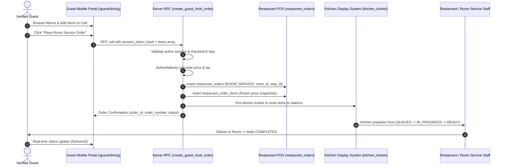

# StayHub QR Food Ordering Architecture (Phase 15)

## 1. Overview & Objectives
StayHub Phase 15 extends the secure Guest QR Portal foundation established in Phase 14 to enable verified in-house guests to browse active restaurant menus and order room service food directly from their mobile devices.

Key operational objectives:
1. **Zero-Trust Identity Resolution**: Client requests submit only a 256-bit SHA-256 session token hash (`stayhub_guest_session` HTTP-only cookie). All contextual parameters (`property_id`, `guest_id`, `stay_id`, `room_id`) are authoritatively resolved server-side.
2. **Reuse Existing Restaurant Architecture**: QR food orders do not create duplicate order tables. They directly instantiate `public.restaurant_orders` with `order_type = 'ROOM_SERVICE'`, line item snapshots in `public.restaurant_order_items`, and order events in `public.restaurant_order_events`.
3. **Seamless KDS Routing**: Room service orders automatically integrate with the kitchen station routing pipeline (`public.kitchen_tickets`, `public.kitchen_ticket_items`) established in Phase 13.
4. **Authoritative Server-Side Pricing**: Client carts cannot dictate item prices, discounts, taxes, or order totals. Server recalculates and freezes prices from `menu_items` at order creation time.
5. **No Billing / Payment Gateways**: In accordance with Phase 15 constraints, room service orders remain operationally complete through restaurant fulfillment without folio posting or online payment processing (reserved for Phase 16).

---

## 2. Order Lifecycle Flow



---

## 3. Server-Side RPC Security

### `create_guest_food_order`
```sql
create_guest_food_order(
  p_session_token_hash VARCHAR(64),
  p_restaurant_id UUID,
  p_items JSONB, -- Array of { menu_item_id: UUID, quantity: INT, notes?: TEXT }
  p_guest_notes TEXT DEFAULT NULL
)
```

#### Verification Steps:
1. Validates `p_session_token_hash` against `public.guest_sessions`.
2. Verifies session is `VERIFIED_STAY`, not revoked, not expired.
3. Resolves `property_id`, `guest_id`, `stay_id`, and `room_id` server-side.
4. Validates that the stay is currently `CHECKED_IN`.
5. Verifies `restaurant_id` belongs to `property_id` and `is_active = true`.
6. Validates every `menu_item_id` belongs to `p_restaurant_id`, is `is_available = true`, and `is_active = true`.
7. Rejects negative, zero, or non-integer quantities.
8. Recomputes subtotal, tax (5%), and total authoritatively.
9. Creates `restaurant_orders` with `order_type = 'ROOM_SERVICE'` and links `room_id`.
10. Automatically triggers kitchen station routing via `create_or_fire_kitchen_ticket`.

---

## 4. Operational Status Mapping

| Database Status (`restaurant_orders`) | KDS State (`kitchen_tickets`) | Guest-Facing Status |
| :--- | :--- | :--- |
| `CONFIRMED` | `QUEUED` | **Order Received** (Kitchen notified) |
| `CONFIRMED` | `IN_PROGRESS` | **Preparing** (Chef is preparing your meal) |
| `CONFIRMED` | `READY` | **Ready for Delivery** (On its way to your room) |
| `COMPLETED` / `SERVED` | `COMPLETED` | **Delivered** (Delivered to room) |
| `CANCELLED` | `CANCELLED` | **Cancelled** |

---

## 5. Multi-Tenant & Session Isolation Guarantees
- **Guest A cannot view Guest B orders**: `get_guest_food_orders` and `get_guest_food_order_detail` filter strictly by `session.guest_id` and `session.stay_id`.
- **URL Parameter Tampering**: Direct URL manipulation (`/guest/orders/[orderId]`) executes session validation; requests for orders outside the authenticated stay return `404 Not Found`.
- **Post-Checkout Invalidation**: Once front desk completes guest checkout, the stay is no longer `CHECKED_IN`, immediately blocking new orders.
