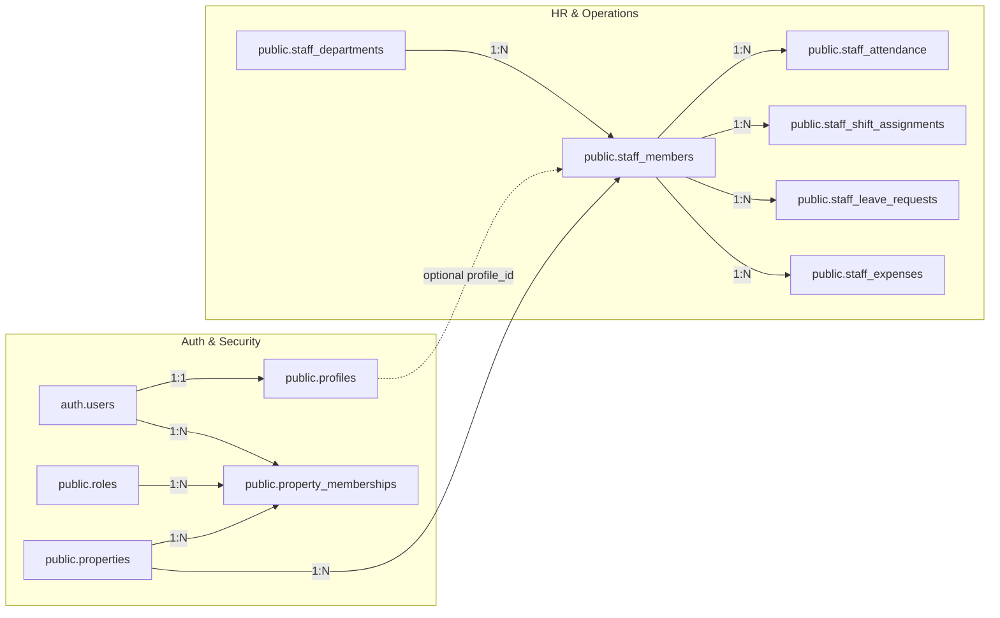

# STAYHUB STAFF SYSTEM — COMPLETE EXISTING SYSTEM AUDIT

**Audit Date:** September 2026  
**Auditor:** Antigravity Engineering OS  
**Status:** Read-Only Audit Complete (Zero Code Modifications, Zero DB Schema Changes, Zero Auth Modifications)

---

## 1. Executive Summary

STAYHUB Hospitality OS is a production-grade, multi-tenant property management and hospitality operations platform built with Next.js 16 (App Router), TypeScript, TailwindCSS/Vanilla CSS tokens, and Supabase (PostgreSQL 15+ with Row-Level Security, Supabase Auth, and Realtime replication).

This audit comprehensively maps the existing staff, role, authentication, task assignment, department, attendance, and operational workflows across Front Desk, Housekeeping, Maintenance, Kitchen Display System (KDS), Guest Services, and Analytics.

### Key Takeaways
1. **Dual Identity Model:** STAYHUB currently uses two distinct entities:
   - `auth.users` + `public.profiles` + `public.property_memberships`: Represents the **login account / security identity** and property-level role binding.
   - `public.staff_members`: Represents the **operational / HR employee record** (employee code, designation, department, contact info, shift/attendance tracking). It has an optional `profile_id` linking to `public.profiles`.
2. **Role Model:** There are **10 seeded system roles** stored in `public.roles` (`SUPER_ADMIN`, `HOTEL_OWNER`, `GENERAL_MANAGER`, `FRONT_DESK`, `RECEPTIONIST`, `HOUSEKEEPING`, `MAINTENANCE`, `RESTAURANT_STAFF`, `KITCHEN_STAFF`, `ACCOUNTANT`).
3. **Permission System:** **No granular database permissions table** (such as `role_permissions` or `user_permissions`) exists in PostgreSQL. Permissions are currently evaluated via TypeScript dictionaries and hardcoded role sets in server actions.
4. **Navigation & Route Protection:** Sidebar and navigation are statically defined in `src/config/navigation.ts`. Navigation items are rendered unconditionally without filtering by the logged-in user's role. Route protection is enforced at the Server Action / RPC level via membership checks, but direct URL navigation in the browser is not restricted by role middleware.
5. **Work Assignment:**
   - **Housekeeping:** Tasks in `housekeeping_tasks` support direct assignment (`assigned_to UUID REFERENCES auth.users(id)`).
   - **Maintenance:** Work orders in `maintenance_work_orders` support technician assignment (`assigned_to UUID REFERENCES auth.users(id)`).
   - **Guest Service Requests:** Requests in `guest_service_requests` support assignment (`assigned_to UUID REFERENCES public.profiles(id)` and `assigned_department`).
   - **Kitchen / KDS:** Tickets in `kitchen_tickets` are **station-based** (e.g. `HOT_KITCHEN`, `COLD_KITCHEN`, `BAR`) rather than assigned to individual chefs.
6. **No Duplication Required:** Future RBAC and granular page permissions can cleanly build on the existing `property_memberships` and `staff_members` foundation without breaking schema or altering operational tables.

---

## 2. Existing Authentication

STAYHUB uses **Supabase Auth** as its core authentication provider with Server-Side Rendering (SSR) session management via `@supabase/ssr`.

### Authentication Flow & Mechanisms
- **Provider:** Supabase GoTrue Auth (`auth.users`).
- **Login Route:** `/login` (`src/app/(auth)/login/page.tsx`).
- **Login Component:** `src/components/auth/login-form.tsx` using `signInAction` from `src/lib/auth/actions.ts`.
- **Signup / Provisioning:** 
  - Standard signup: `/signup` (`src/app/(auth)/signup/page.tsx`) calling `signUpAction`.
  - Staff auto-provisioning: When a manager adds an employee in `/staff` with an email address, `createStaffMemberAction` invokes `createAdminClient().auth.admin.createUser` to create an auth account with default password `StayHub@2026`, creates/links `profiles`, and creates `property_memberships`.
- **Password Reset:**
  - Self-service: `/forgot-password` and `/reset-password` (`forgotPasswordAction`, `resetPasswordAction`).
  - Manager-driven: `resetStaffPasswordAction` in `src/lib/staff/actions.ts` allows a property manager to reset an employee's password to default or a custom string via Supabase Admin API.
- **Session Handling:** HTTP-only session cookies managed by Next.js middleware (`src/middleware.ts` delegating to `src/lib/supabase/middleware.ts`). The active property context is tracked via the `stayhub_active_property_id` cookie.
- **Client Auth Context:** `AuthProvider` (`src/lib/auth/context.tsx`) provides `user`, `profile`, `memberships`, `currentProperty`, `currentRole`, `switchProperty`, and `signOut`.

### Answers to Mandatory Questions
1. **How does a user currently log in?** Via email and password at `/login` invoking `signInWithPassword` through `signInAction`.
2. **Where is the authenticated user's identity stored?** In Supabase GoTrue `auth.users`, synchronized with `public.profiles` (`auth_user_id = auth.users.id`).
3. **Is there already a staff/user profile table?** Yes, two tables exist: `public.profiles` (user account profile) and `public.staff_members` (hotel employee record).
4. **Is there already a role associated with the user?** Yes, via `public.property_memberships.role_id` which references `public.roles.id`.
5. **Where is role information stored?** In the **`property_memberships`** table (`property_id`, `user_id`, `role_id`).
6. **How are protected pages currently enforced?**
   - Middleware redirects unauthenticated requests on `/(app)/*` to `/login`.
   - Server actions enforce property-level membership and role permissions per action.
   - Client-side page components read `useAuth()` to get `currentProperty` and `currentRole`.

---

## 3. Existing Staff/User Architecture

### Dual Entity Architecture

### Table Relations
- `public.profiles`: `id`, `auth_user_id`, `email`, `full_name`, `avatar_url`, `phone`, `status`, `created_at`, `updated_at`.
- `public.property_memberships`: `id`, `property_id`, `user_id` (references `auth.users.id`), `role_id` (references `roles.id`), `status` (`active`/`invited`/`suspended`), `created_at`, `updated_at`.
- `public.staff_members`: `id`, `property_id`, `profile_id` (nullable FK to `profiles.id`), `employee_code`, `first_name`, `last_name`, `display_name`, `phone`, `email`, `department_id`, `designation`, `employment_type`, `employment_status`, `joining_date`, `leaving_date`, `is_active`, `notes`.

---

## 4. Existing Roles

The database contains 10 system roles in `public.roles` seeded via migration `20260925000001_create_identity_and_tenancy.sql`.

| Role Code | Role Name | System / Custom | Level (Hierarchy) | Primary Operational Scope |
|---|---|---|---|---|
| `SUPER_ADMIN` | Super Administrator | System | 100 | Platform-wide cross-tenant administration |
| `HOTEL_OWNER` | Hotel Owner | System | 90 | Full commercial & operational control for property |
| `GENERAL_MANAGER` | General Manager | System | 80 | Full daily operational management across departments |
| `FRONT_DESK` | Front Desk Supervisor | System | 60 | Check-in/out, folio billing, reservations, room assignments |
| `RECEPTIONIST` | Receptionist / Agent | System | 50 | Front desk check-in, guest services, walk-ins |
| `HOUSEKEEPING` | Housekeeping Staff | System | 40 | Room turnovers, inspections, housekeeping guest requests |
| `MAINTENANCE` | Maintenance Technician | System | 40 | Work orders, repairs, asset maintenance, OOO rooms |
| `RESTAURANT_STAFF` | Restaurant / F&B Staff | System | 40 | POS dining orders, table management, in-room dining |
| `KITCHEN_STAFF` | Kitchen Chef / Staff | System | 40 | KDS ticket preparation, stations, 86/stock items |
| `ACCOUNTANT` | Financial Accountant | System | 70 | Billing audit, folios, tax invoices, revenue reports |

**Hierarchy & Role Helpers (`src/lib/auth/roles.ts`):**
- `ROLE_LEVELS`: Defines numerical weight from 100 (`SUPER_ADMIN`) to 40 (`HOUSEKEEPING`, `MAINTENANCE`, `KITCHEN_STAFF`, `RESTAURANT_STAFF`).
- Helper functions: `isSuperAdmin()`, `isHotelManager()`, `isFrontDesk()`, `canManageStaff()`, `canViewFinancials()`, `canPerformCheckIn()`.

---

## 5. Existing Permission System

### Current Status: **No granular staff page/action permission system currently exists in the database.**

What currently exists:
1. **Hardcoded Role-Capability Lists:** Stored in TypeScript files:
   - `src/lib/staff/permissions-data.ts`: `ROLE_CAPABILITIES` (text summaries of can/cannot do) and `MODULE_PERMISSIONS` (allowed role codes per module).
   - `src/lib/housekeeping/permissions.ts`: `HOUSEKEEPING_ROLE_PERMISSIONS` mapping 6 permissions (`HOUSEKEEPING_VIEW`, `HOUSEKEEPING_ASSIGN`, `HOUSEKEEPING_START`, `HOUSEKEEPING_COMPLETE`, `HOUSEKEEPING_INSPECT`, `HOUSEKEEPING_MANAGE`).
   - `src/lib/maintenance/permissions.ts`: `MAINTENANCE_ROLE_PERMISSIONS` mapping 6 permissions (`MAINTENANCE_VIEW`, `MAINTENANCE_CREATE`, `MAINTENANCE_ASSIGN`, `MAINTENANCE_UPDATE`, `MAINTENANCE_RESOLVE`, `MAINTENANCE_MANAGE`).
   - `src/lib/kds/permissions.ts`: `KDS_ROLE_PERMISSIONS` mapping 4 permissions (`KDS_VIEW`, `KDS_UPDATE`, `KDS_BUMP`, `KDS_MANAGE`).
   - `src/lib/guest-services/permissions.ts`: `GUEST_REQUEST_ROLE_PERMISSIONS` mapping 4 permissions (`GUEST_REQUEST_VIEW`, `GUEST_REQUEST_UPDATE`, `GUEST_REQUEST_ASSIGN`, `GUEST_REQUEST_RESOLVE`).
2. **Navigation Config:** `src/config/navigation.ts` has static `permission` strings (e.g. `"housekeeping.view"`, `"staff.view"`, `"maintenance.view"`), but they are **not dynamically evaluated** against user permissions.
3. **Database Tables:** Tables like `role_permissions`, `user_permissions`, or `staff_module_permissions` **do not exist**.

---

## 6. Existing Database Tables

### Core Identity & Tenancy Tables
- `public.organizations`: Tenancy root (`id`, `name`, `slug`, `status`).
- `public.properties`: Hotel properties (`id`, `organization_id`, `name`, `code`, `timezone`, `currency`, `status`).
- `public.profiles`: User identity profiles (`id`, `auth_user_id`, `email`, `full_name`, `avatar_url`, `phone`, `status`).
- `public.roles`: System and custom security roles (`id`, `code`, `name`, `description`, `is_system`).
- `public.property_memberships`: User-to-Property role assignment (`id`, `property_id`, `user_id`, `role_id`, `status`).

### Staff & HR Tables (`20260925000020_create_staff_and_expenses.sql`)
- `public.staff_departments`: Property departments (`id`, `property_id`, `name`, `department_code`, `description`, `is_active`).
- `public.staff_members`: Employee records (`id`, `property_id`, `profile_id`, `employee_code`, `first_name`, `last_name`, `display_name`, `phone`, `email`, `department_id`, `designation`, `employment_type`, `employment_status`, `joining_date`, `leaving_date`, `manager_staff_id`, `is_active`, `notes`).
- `public.staff_attendance`: Daily attendance logs (`id`, `property_id`, `staff_id`, `attendance_date`, `check_in_at`, `check_out_at`, `status`, `source`, `approved_by`).
- `public.staff_shifts`: Shift templates (`id`, `property_id`, `department_id`, `name`, `start_time`, `end_time`, `break_minutes`, `is_overnight`, `is_active`).
- `public.staff_shift_assignments`: Shift rosters (`id`, `property_id`, `staff_id`, `shift_id`, `shift_date`, `status`).
- `public.staff_leave_requests`: Leave records (`id`, `property_id`, `staff_id`, `leave_type`, `start_date`, `end_date`, `days`, `status`, `approved_by`).
- `public.staff_expenses` & `public.staff_expense_receipts`: Employee expenses and receipts.

### Operations Tables
- `public.housekeeping_tasks`: Room cleaning tasks (`id`, `property_id`, `room_id`, `task_type`, `status`, `priority`, `assigned_to` -> `auth.users(id)`, `scheduled_for`, `started_at`, `completed_at`, `created_by`, `completed_by`).
- `public.housekeeping_inspections`: Cleaning audits (`id`, `property_id`, `housekeeping_task_id`, `room_id`, `inspector_id` -> `auth.users(id)`, `result`, `notes`, `inspected_at`).
- `public.maintenance_work_orders`: Repair tickets (`id`, `property_id`, `room_id`, `asset_id`, `title`, `description`, `category`, `priority`, `status`, `reported_by` -> `auth.users(id)`, `assigned_to` -> `auth.users(id)`, `scheduled_for`, `started_at`, `resolved_at`).
- `public.maintenance_work_order_events`: Maintenance audit logs (`id`, `work_order_id`, `event_type`, `from_status`, `to_status`, `performed_by` -> `auth.users(id)`).
- `public.guest_service_requests`: QR guest requests (`id`, `property_id`, `guest_id`, `stay_id`, `room_id`, `category`, `request_type`, `title`, `priority`, `status`, `requested_at`, `assigned_to` -> `public.profiles(id)`, `assigned_department`, `started_at`, `completed_at`).
- `public.guest_service_request_events`: Guest request timeline (`id`, `request_id`, `event_type`, `from_status`, `to_status`, `actor_type`, `actor_profile_id` -> `public.profiles(id)`).
- `public.kitchen_tickets`: KDS tickets (`id`, `property_id`, `restaurant_id`, `restaurant_order_id`, `ticket_number`, `status`, `priority`, `fired_at`, `started_at`, `ready_at`, `completed_at`).
- `public.kitchen_ticket_items`: Individual KDS items (`id`, `kitchen_ticket_id`, `station_id` -> `kitchen_stations(id)`, `status`, `started_at`, `ready_at`, `completed_at`).

---

## 7. Existing Staff Routes

| Route | Purpose | Current Access | Protection Mechanism | Key Files |
|---|---|---|---|---|
| `/staff` | Staff Directory, Passcode Console, RBAC Matrix, Departments | Any authenticated property member | Server action `verifyAuth`, client `useAuth()` | `src/app/(app)/staff/page.tsx`, `src/components/staff/*` |
| `/dashboard` | Operational Overview & KPIs | Authenticated property members | Session Auth | `src/app/(app)/dashboard/page.tsx` |
| `/front-desk` | Arrivals, departures, stays, keycards | Authenticated property members | Session Auth | `src/app/(app)/front-desk/page.tsx` |
| `/housekeeping` | Cleaning roster, board, inspections | Authenticated property members | Housekeeping permission checks in actions | `src/app/(app)/housekeeping/page.tsx` |
| `/housekeeping/inspections` | Inspection audits | Authenticated property members | Housekeeping permission checks | `src/app/(app)/housekeeping/inspections/page.tsx` |
| `/maintenance` | Work orders, assets, repairs | Authenticated property members | Maintenance permission checks in actions | `src/app/(app)/maintenance/page.tsx` |
| `/guest-requests` | Guest QR service request queues | Authenticated property members | Guest request permission checks | `src/app/(app)/guest-requests/page.tsx` |
| `/kitchen` or `/restaurant/kds` | Live Kitchen Display System | Authenticated property members | KDS permission checks | `src/app/(app)/kitchen/page.tsx` |
| `/reports/staff` | Staff attendance and roster report | Authenticated property members | Report permission checks in actions | `src/app/(app)/reports/staff/page.tsx` |
| `/settings` | System settings (placeholder) | Authenticated property members | Session Auth | `src/app/(app)/settings/page.tsx` |

---

## 8. Existing Housekeeping Workflow

### Audit Details
- **Task Types:** `CLEANING`, `DEEP_CLEAN`, `TURNDOWN`, `INSPECTION`, `LINEN_CHANGE`, `TOUCHUP`.
- **Task Statuses:** `PENDING` -> `ASSIGNED` -> `IN_PROGRESS` -> `INSPECTION_PENDING` -> `COMPLETED` (or `CANCELLED`).
- **Room Status Synchronization:** Starting a task moves room status to `CLEANING`. Completing task moves room housekeeping status to `INSPECTING` or `CLEAN`.
- **Inspections:** Dedicated `housekeeping_inspections` table supporting `PASSED` / `FAILED` results with notes and inspector tracking.
- **Timestamps:** `scheduled_for`, `started_at`, `completed_at`, `cancelled_at`, `created_at`, `updated_at`.
- **Realtime:** Live Postgres subscription on `housekeeping_tasks` table updates state across UI.

### Answer to Mandatory Question
**Can a manager currently assign a housekeeping task to a specific staff member?**  
**YES.**  
**How:** Through `assignHousekeepingTaskAction` (and the `assign_housekeeping_task` RPC), which updates `housekeeping_tasks.assigned_to = p_assigned_to` and sets `status = 'ASSIGNED'`. The `assigned_to` parameter is a user ID validated against `property_memberships`.

---

## 9. Existing Maintenance Workflow

### Audit Details
- **Work Orders:** Managed in `maintenance_work_orders`.
- **Categories:** `PLUMBING`, `ELECTRICAL`, `HVAC`, `APPLIANCE`, `FURNITURE`, `LIGHTING`, `DOOR_LOCK`, `TV`, `WIFI_NETWORK`, `CIVIL`, `SAFETY`, `OTHER`.
- **Status Lifecycle:** `OPEN` -> `ASSIGNED` -> `IN_PROGRESS` -> `ON_HOLD` -> `RESOLVED` -> `CLOSED` (or `CANCELLED`).
- **Room Out-of-Order Link:** Creating an urgent work order can automatically set room operational status to `OUT_OF_ORDER`.
- **Audit Timeline:** `maintenance_work_order_events` captures every status change, timestamp, and `performed_by` user.
- **Preventive Maintenance:** `maintenance_schedules` supports recurring schedules (`DAILY`, `WEEKLY`, `MONTHLY`, `QUARTERLY`, `YEARLY`).

### Answer to Mandatory Question
**Can a manager currently assign maintenance work to a specific staff member?**  
**YES.**  
**How:** Via `assignWorkOrderAction` (and `assign_maintenance_work_order` RPC), which updates `maintenance_work_orders.assigned_to = p_assigned_to` and sets `status = 'ASSIGNED'`, logging an `ASSIGNED` event in `maintenance_work_order_events`.

---

## 10. Existing Kitchen/KDS Workflow

### Audit Details
- **Tickets & Items:** `kitchen_tickets` and `kitchen_ticket_items`.
- **Stations:** Routed to `kitchen_stations` (`HOT_KITCHEN`, `COLD_KITCHEN`, `BAR`, `DESSERT`, `BAKERY`, etc.) based on `menu_item_kitchen_stations`.
- **Status Flow:** `QUEUED` -> `IN_PROGRESS` -> `READY` -> `COMPLETED` (or `CANCELLED` / `REMAKE`).
- **Acoustic / Audio Alerts:** Sound synthesis (buzzer) plays when new orders arrive.
- **Realtime:** Supabase realtime replication on `kitchen_tickets` and `kitchen_ticket_items`.
- **Performer Tracking:** `kitchen_ticket_events` logs `performed_by` user on actions (start, ready, complete, remake).

### Answer to Mandatory Question
**Can kitchen work currently be assigned to a specific kitchen staff member?**  
**NO.**  
**Current Workflow:** Kitchen work is **station-based**, not individually assigned. Any chef or kitchen staff viewing the KDS for a station can bump or progress tickets. Individual chef assignment is not part of the current schema.

---

## 11. Existing Task/Work Assignment System

### Audit Details
- **Generic System:** **No single generic `tasks` table exists.**
- **Domain-Specific Systems:**
  1. `housekeeping_tasks`: Assigned to `auth.users(id)`.
  2. `maintenance_work_orders`: Assigned to `auth.users(id)`.
  3. `guest_service_requests`: Assigned to `public.profiles(id)` and `assigned_department`.
  4. `staff_shift_assignments`: Assigned to `public.staff_members(id)`.

---

## 12. Existing Guest Request Assignment

### Audit Details
- **Status Lifecycle:** `SUBMITTED` -> `ACKNOWLEDGED` -> `ASSIGNED` -> `IN_PROGRESS` -> `COMPLETED` (or `CANCELLED`, `REJECTED`).
- **Assignment Field:** `guest_service_requests.assigned_to` (FK to `public.profiles.id`) and `assigned_department` (VARCHAR).
- **Acknowledgment:** Tracked with `acknowledged_at` and `acknowledged_by`.
- **Completion:** Tracked with `completed_at`.
- **Audit Log:** `guest_service_request_events` records `event_type`, `from_status`, `to_status`, `actor_type`, `actor_profile_id`, and `actor_name`.
- **Realtime:** Realtime channel active for staff updates; guest portal polls secure endpoint `getGuestRequestLiveStatusAction`.

---

## 13. Existing Staff Profiles

### Profile Fields Inventory

| Field | In `public.profiles` | In `public.staff_members` | Status |
|---|---|---|---|
| Full Name | `full_name` | `first_name`, `last_name`, `display_name` | DIRECTLY STORED |
| Profile Photo / Avatar | `avatar_url` | None (reads from linked profile) | DIRECTLY STORED |
| Email | `email` | `email` | DIRECTLY STORED |
| Phone | `phone` | `phone` | DIRECTLY STORED |
| Employee ID / Code | None | `employee_code` (Unique per property) | DIRECTLY STORED |
| Designation / Title | None | `designation` | DIRECTLY STORED |
| Department | None | `department_id` -> `staff_departments` | DIRECTLY STORED |
| Property Relationship | Via `property_memberships` | `property_id` | DIRECTLY STORED |
| Employment Type | None | `employment_type` (`FULL_TIME`, `PART_TIME`, etc.) | DIRECTLY STORED |
| Employment Status | `status` | `employment_status` (`ACTIVE`, `ON_LEAVE`, etc.) | DIRECTLY STORED |
| Joining Date | None | `joining_date` | DIRECTLY STORED |
| Leaving Date | None | `leaving_date` | DIRECTLY STORED |
| Emergency Contact | None | `emergency_contact_name`, `emergency_contact_phone` | DIRECTLY STORED |
| Address | None | `address` | DIRECTLY STORED |
| Notes | None | `notes` | DIRECTLY STORED |
| Manager Hierarchy | None | `manager_staff_id` | DIRECTLY STORED |

---

## 14. Existing Attendance

### Audit Details
- **Tables:** `public.staff_attendance`, `public.staff_shifts`, `public.staff_shift_assignments`, `public.staff_leave_requests`.
- **Link to Staff:** Directly linked via `staff_id UUID REFERENCES public.staff_members(id)`.
- **Fields:** `attendance_date`, `check_in_at`, `check_out_at`, `status` (`PRESENT`, `ABSENT`, `LATE`, `HALF_DAY`, `ON_LEAVE`), `source` (`MANUAL`, `BIOMETRIC`, `QR_SCAN`), `notes`, `approved_by`.
- **Unique Constraint:** `UNIQUE(property_id, staff_id, attendance_date)` ensures exactly one record per staff member per day.
- **Shifts & Rostering:** `staff_shifts` defines working hours and break minutes; `staff_shift_assignments` assigns shifts to staff for dates.
- **Reporting:** `/reports/staff` already reads from `staff_attendance` and `staff_members` to calculate attendance rates, late check-ins, and shift coverage.

---

## 15. Existing Staff Performance Data

### Metrics Classification

#### A. Directly Stored in Database
- Attendance logs (`present`, `absent`, `late`, `on_leave` count) in `staff_attendance`.
- Shift scheduled vs completed count in `staff_shift_assignments`.
- Leave days taken in `staff_leave_requests`.
- Task timestamps: `created_at`, `started_at`, `completed_at`, `resolved_at`, `inspected_at`.

#### B. Can Be Derived (Calculated via SQL/Queries)
- **Assigned Tasks Count:** `COUNT(*) FROM housekeeping_tasks WHERE assigned_to = user_id`.
- **Completed Housekeeping Tasks:** `COUNT(*) FROM housekeeping_tasks WHERE assigned_to = user_id AND status = 'COMPLETED'`.
- **Average Cleaning Duration:** `AVG(completed_at - started_at) FROM housekeeping_tasks WHERE assigned_to = user_id`.
- **Inspection Pass Rate:** `COUNT(CASE WHEN result = 'PASSED' THEN 1 END) / COUNT(*)` from `housekeeping_inspections`.
- **Assigned Maintenance Jobs:** `COUNT(*) FROM maintenance_work_orders WHERE assigned_to = user_id`.
- **Resolved Maintenance Jobs:** `COUNT(*) FROM maintenance_work_orders WHERE assigned_to = user_id AND status = 'RESOLVED'`.
- **Average Resolution Time:** `AVG(resolved_at - started_at)` from `maintenance_work_orders`.
- **Service Requests Handled:** `COUNT(*) FROM guest_service_requests WHERE assigned_to = profile_id AND status = 'COMPLETED'`.
- **Attendance Rate %:** `(present + late) / total_scheduled_days * 100`.

#### C. Not Currently Available
- Subjective guest ratings linked directly to a specific staff member.
- GPS / Geolocation check-ins.
- Biometric hardware synchronization daemon (source column exists, but hardware sync bridge is not implemented).
- Staff performance leaderboard UI view.

---

## 16. Existing Reports

The Reports module (`src/app/(app)/reports` and `src/lib/reports`) includes:
- **Staff Attendance & Rostering Report** (`/reports/staff`): Active staff, present, absent, late, on-leave, attendance percentage, scheduled shifts.
- **Housekeeping Operational Report** (`/reports/housekeeping`): Cleaned rooms, dirty rooms, turndown count, inspection pass/fail rate.
- **Maintenance Report** (`/reports/maintenance`): Open work orders, mean time to resolve (MTTR), category breakdown.
- **Guest Services Report** (`/reports/guest-services`): Request volumes, category distribution, resolution duration.
- **F&B / Kitchen Report** (`/reports/restaurant`): Prep times, ticket volume, KDS station load.

---

## 17. Existing Sidebar/Navigation Authorization

### Evaluation

1. **Can the system currently hide a page from the sidebar based on the logged-in user's role?**  
   **NO.**  
   `src/components/layout/sidebar.tsx` and `src/components/layout/mobile-nav.tsx` iterate through `navigationConfig` from `src/config/navigation.ts` directly and render all navigation items unconditionally.

2. **Can the system currently prevent direct URL access?**  
   **PARTIALLY.**  
   - Direct URL access to `/(app)/*` is restricted to authenticated users by middleware.
   - However, once authenticated, Next.js middleware does **not** check the user's role before serving page HTML/JS bundles.
   - When a user performs an action or loads data, Server Actions and RPCs **do** check role permissions and reject unauthorized actions.

---

## 18. Existing RLS & Security Model

### Multi-Layer Security Overview
- **Layer 1: Database Row-Level Security (RLS):** Enabled on all tables (`staff_members`, `staff_attendance`, `housekeeping_tasks`, `maintenance_work_orders`, `guest_service_requests`, etc.) using tenant isolation helper `public.user_belongs_to_property(auth.uid(), property_id)`.
- **Layer 2: Database RPC Functions (`SECURITY DEFINER`):** Business logic functions (e.g. `assign_housekeeping_task`, `assign_maintenance_work_order`, `staff_assign_guest_request`) enforce tenant and membership constraints.
- **Layer 3: Server Actions:** Verify active property membership and evaluate role capabilities before executing queries or mutations.
- **Layer 4: UI State:** Client components conditionally display action buttons based on `useAuth()`.

### Security Gaps Identified
- **Sidebar Rendering:** Staff members (e.g. Housekeeping) see links to Billing, POS, and Settings in the sidebar even though actions on those pages will fail.
- **Page Route Guards:** Visiting `/staff`, `/billing`, or `/expenses` directly as a Housekeeper loads the page shell before server actions fail.
- **No Dynamic DB Permission Overrides:** A manager cannot grant or revoke specific page permissions to a single staff member without changing their entire role.

---

## 19. Existing Multi-Tenant Model

STAYHUB enforces multi-tenancy at two levels:
1. **Organization Level (`public.organizations`):** Top-level company/chain entity.
2. **Property Level (`public.properties`):** Individual hotel, resort, or property.

### Tenant Isolation Rules
- **Can a staff member belong to one property?** Yes (most common case).
- **Can a staff member belong to multiple properties?** Yes, via multiple rows in `public.property_memberships` with different `role_id`s per property.
- **Can a manager manage multiple properties?** Yes, the property switcher cookie `stayhub_active_property_id` switches active tenant context, and `PropertySelector` UI allows switching between authorized properties.
- **How is tenant isolation enforced?** Every operational query and RLS policy includes `property_id` filtering validated against `property_memberships`.

---

## 20. Existing Realtime System

STAYHUB uses Supabase Realtime Channels (PostgreSQL WAL replication):

| Realtime Channel | Tables / Events | Purpose | Consumer Components |
|---|---|---|---|
| `guest_requests:${propertyId}` | `guest_service_requests` (INSERT, UPDATE) | Live request queue & acoustic alert triggers | `OperationalAlertProvider`, `GuestRequestsView`, `DashboardGuestRequests` |
| `restaurant_orders:${propertyId}` | `restaurant_orders` (INSERT, UPDATE) | Dining order updates & KDS notifications | `OperationalAlertProvider`, `KdsTerminal`, `RestaurantOrdersView` |
| `kds_tickets:${propertyId}` | `kitchen_tickets`, `kitchen_ticket_items` | Kitchen prep line updates & timer bumps | `KdsTerminal`, `KitchenPage` |
| `housekeeping:${propertyId}` | `housekeeping_tasks` (UPDATE) | Realtime cleaning room turnover updates | `HousekeepingBoard`, `RoomGrid` |
| `maintenance:${propertyId}` | `maintenance_work_orders` (INSERT, UPDATE) | Realtime work order status updates | `MaintenanceBoard`, `MaintenanceDetail` |

---

## 21. Existing Notifications & Alerts

- **Acoustic / Audio Buzzer:** Web Audio API sound synthesizer in `src/lib/alerts/sound-synthesizer.ts` and `operational-alert-manager.ts` plays urgent repeating chimes for unacknowledged guest requests and food orders.
- **In-App Visual Modal:** `OperationalAlertModal` pops up when an urgent request is received.
- **Notifications Dropdown:** `src/components/layout/notifications-dropdown.tsx` displays notification lists and unread badges.
- **Toasts:** Sonner / custom UI toast component (`src/components/ui/toast.tsx`) confirms action success/error.

---

## 22. Existing Account / Settings Page

- **User Profile Menu:** `src/components/layout/profile-menu.tsx` displays user name, email, active role, and active property.
- **Current Settings Route:** `/settings` (`src/app/(app)/settings/page.tsx`) is currently a placeholder page displaying "Property & System Settings (Phase 5)".
- **Staff Credentials Console:** Located at `/staff` under the "Portal Logins & Passcodes" tab (`src/components/staff/staff-credentials-view.tsx`), allowing managers to view login emails, copy credentials, and reset passwords.

---

## 23. Existing Architecture Duplications & Conflicts

1. **`public.profiles` vs `public.staff_members`:**
   - `profiles` represents the login account (has `auth_user_id`).
   - `staff_members` represents the employee record (has `employee_code`, `department_id`, etc.).
   - `staff_members.profile_id` is optional/nullable. If an employee is created without an email, they exist only in `staff_members` and cannot log in.
2. **Assignment Target Inconsistency:**
   - `housekeeping_tasks.assigned_to` -> References `auth.users(id)`.
   - `maintenance_work_orders.assigned_to` -> References `auth.users(id)`.
   - `guest_service_requests.assigned_to` -> References `public.profiles(id)`.
   - `staff_attendance.staff_id` -> References `public.staff_members(id)`.
   *(Note: Since `auth.users.id` matches `profiles.auth_user_id` and `staff_members.profile_id` links to `profiles.id`, all three are bridgeable without data loss).*
3. **Roles vs Departments:**
   - `public.roles` is security-oriented (`HOUSEKEEPING`, `MAINTENANCE`, `KITCHEN_STAFF`).
   - `public.staff_departments` is operational/organizational (`Housekeeping & Environmental`, `Engineering & Facilities`, `Food & Beverage`).
   - A staff member has both a `role_id` (via `property_memberships`) and a `department_id` (via `staff_members`).

---

## 24. What Already Works

- Complete staff directory UI with search, department filtering, status toggling, and grid/table views.
- Manager password reset and login credential copying console (`StaffCredentialsView`).
- Complete role capability and module permission matrix documentation view (`RolePermissionMatrix`).
- Multi-property membership model and property switcher.
- Domain task creation, assignment, and status updates for Housekeeping, Maintenance, and Guest Requests.
- Station-based KDS ticket pipeline with timers and audio alerts.
- Attendance table schema and basic reporting in `/reports/staff`.
- Realtime replication channels for operational alerts across departments.

---

## 25. What Is Partially Implemented

- **Staff Assignment in UI:** Assignment RPCs exist and work, but dropdowns in some UI views populate from `profiles` / `property_memberships` rather than `staff_members`.
- **Staff Performance Reporting:** Attendance metrics work, but operational metrics (housekeeping tasks completed, maintenance turnaround time, requests resolved per staff member) are not yet aggregated into a single Staff Performance view.
- **Settings & Profile Page:** `/settings` is a placeholder.

---

## 26. What Is Missing

1. **Granular Page & Module Permissions Schema:** No database table storing granular page permissions per staff member or role (e.g. check/tick permissions for individual pages/modules).
2. **Role-Aware Sidebar / Navigation Filtering:** Sidebar currently renders all items regardless of user role.
3. **Staff-Specific Dedicated Work Hubs:**
   - Housekeeping staff dedicated "My Tasks" view.
   - Maintenance technician dedicated "My Work Orders" view.
   - Kitchen staff dedicated station view.
4. **Staff Performance & Work History Dashboard:** A dedicated view showing completed tasks, active workload, and completion metrics per staff member.
5. **My Profile / Account Screen:** A page for staff to view their personal details, assigned role, and work statistics.

---

## 27. What Must NOT Be Changed

To preserve system stability and operational continuity:
- **DO NOT** alter Supabase Auth or session cookie structure (`stayhub_active_property_id`, middleware token refresh).
- **DO NOT** drop or modify existing columns in `public.profiles`, `public.roles`, or `public.property_memberships`.
- **DO NOT** alter existing task status state machines in `housekeeping_tasks`, `maintenance_work_orders`, or `guest_service_requests`.
- **DO NOT** alter the KDS station routing logic (`kitchen_stations`, `menu_item_kitchen_stations`).
- **DO NOT** break existing tenant isolation triggers (`check_housekeeping_task_tenant_consistency`, etc.).

---

## 28. Recommended Future Implementation Architecture

To fulfill all business requirements cleanly without duplicating architecture:

### 1. Granular Permission Schema Extension
Add a non-destructive permissions table linking to `property_memberships` or `roles`:
- `staff_page_permissions`:
  - `property_membership_id` (FK to `property_memberships(id)`)
  - `module_key` (e.g. `"housekeeping"`, `"maintenance"`, `"kitchen"`, `"pos"`, `"billing"`, `"reports"`, `"staff"`, `"settings"`)
  - `can_view` (BOOLEAN)
  - `can_edit` (BOOLEAN)
  - `can_delete` (BOOLEAN)
  - `created_at`, `updated_at`

### 2. Navigation & Route Guard Layer
- Filter `navigationConfig` items in `Sidebar` and `MobileNav` using a lightweight hook: `usePermissions()`.
- Staff members with role `HOUSEKEEPING` will only see: Housekeeping, Guest Requests (relevant), My Profile, Attendance.
- Staff members with role `MAINTENANCE` will only see: Maintenance, Guest Requests (relevant), My Profile, Attendance.
- Staff members with role `KITCHEN_STAFF` will only see: Kitchen (KDS), My Profile.
- Managers / Super Admins will see all modules according to their permissions.

### 3. Unified Staff Assignment Resolver
Standardize all assignment dropdowns to query `staff_members` joined with `profiles` and `property_memberships` for the active property.

### 4. Staff Performance & Work History Aggregator
Build an analytics query aggregating:
- Tasks assigned vs completed across `housekeeping_tasks`, `maintenance_work_orders`, and `guest_service_requests`.
- Average completion time and inspection pass rates.
- Attendance summary from `staff_attendance`.

---

## 29. Recommended Phase Breakdown (Planning Only)

*Note: Planning only — zero implementation performed during this audit.*

- **Phase 1: Database Permission Schema & Security Foundation**
  - Create non-destructive `staff_page_permissions` table.
  - Seed default permission templates matching the 10 existing roles.
  - Implement permission evaluation helper functions.
- **Phase 2: Dynamic Navigation & Route Guards**
  - Update `Sidebar` and `MobileNav` to filter nav items based on user permissions.
  - Add page-level route authorization wrappers.
- **Phase 3: Manager Staff Management & Tick/Check Permissions UI**
  - Add permissions editing drawer/modal in `/staff` with checkboxes for each page/module.
  - Enable/disable staff accounts and manage credentials.
- **Phase 4: Role-Specific Staff Workspaces**
  - Housekeeping staff workspace with personal task queue and cleaning status actions.
  - Maintenance technician workspace with assigned work orders and repair logging.
  - Kitchen staff KDS workspace.
- **Phase 5: Staff Performance, Workload & History Hub**
  - Manager view: workload distribution, completion rates, response times.
  - Staff personal view: completed history and performance stats.
- **Phase 6: Staff Profile & Self-Service Account Portal**
  - Personal profile view for staff (`/profile` or `/account`).
  - View personal roster, attendance, and credentials.
